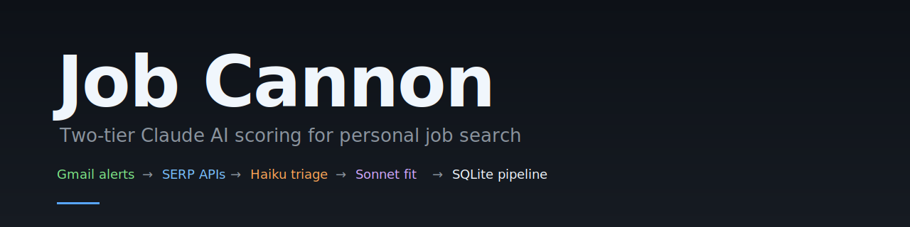
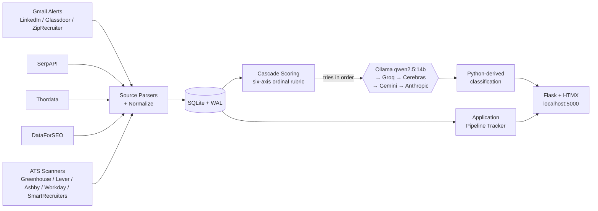

# Job Cannon



> A personal job-search command center: aggregates listings from Gmail
> alerts and SERP APIs, **proactively scrapes career pages from a
> curated company watchlist** (5-platform ATS coverage —
> Greenhouse / Lever / Ashby / SmartRecruiters / Workday — plus a
> tier-4 AI navigator for custom sites), scores everything with a
> cascade-routed AI pipeline (free local + free cloud providers, with
> the Anthropic CLI as $0 fallback via your Claude.ai subscription),
> and tracks application state.
> Single-user, runs on localhost.

[](https://github.com/Senkichi/job-cannon/actions/workflows/ci.yml)
[](https://codecov.io/gh/Senkichi/job-cannon)
[](https://www.python.org/downloads/)
[](https://github.com/astral-sh/ruff)
[](LICENSE)

## Install

```bash
pipx install job-cannon
job-cannon
```

`pipx install job-cannon` is the recommended path: one command, isolated venv, no Python-version conflicts. The `job-cannon` command launches the Flask app on http://localhost:5000 and opens your browser. On first launch the onboarding wizard auto-detects AI providers (Ollama / Claude Code CLI / Gemini CLI), helps you connect Gmail via IMAP app password, and writes secrets to your OS keyring — no manual YAML editing required.

**Don't have pipx yet?** Per-OS one-liners: `scoop install pipx` (Windows), `brew install pipx` (macOS), `sudo apt install pipx` (Ubuntu 23.04+).

**Already cloning the repo to hack on it?** See [For Contributors](#for-contributors) at the bottom.

**Other install paths and troubleshooting:** [INSTALL.md](INSTALL.md).

## Engineering Highlights

- **Single-tier ordinal scoring through a multi-provider cascade.**
  Every job runs through one `'scoring'` tier with a six-axis ordinal
  rubric. The cascade tries free providers first
  (Ollama local → Groq → Cerebras → Gemini) and falls through to
  Anthropic only when all free options are exhausted or rate-limited.
  Phase 33 shootout selected `qwen2.5:14b` (Ollama) as the production
  primary; typical monthly cost is ~$0. Classification
  (`apply | consider | skip | reject`) is **derived in Python from
  the numeric sub-scores — never emitted by the LLM** — which
  prevents classification drift across model swaps.
- **Schema-versioned SQLite migrations.** 48 idempotent migrations
  applied via `pragma user_version`. Migration 41 introduces a
  backup-recency preflight that refuses destructive schema changes
  without a recent userdata snapshot (override via
  `GSD_BACKUP_CONFIRMED=1` for alternate backup schemes).
- **Background scheduler with cross-process safety.** APScheduler 3.x
  with a pidfile + psutil liveness check — survives Flask reloads,
  single-instance enforced. Auto-starts a local Ollama service for the
  nightly agentic-backfill tier.
- **HTMX-only frontend.** No JS framework, no bundler, no build step.
  Inline expansion, partial fragments, server-driven UI. 36 Jinja2
  templates, Tailwind via CDN, SortableJS for the kanban.
- **ATS coverage across 5 platforms with a tier-4 AI navigator.**
  Greenhouse, Lever, Ashby, SmartRecruiters, and Workday have explicit
  scanners; the AI navigator caches Playwright recipes (16 active) for
  the long-tail of custom-built career sites (iCIMS, Phenom, UKG,
  bespoke).
- **Eval harness with paired MAE + BCa bootstrap 95% CIs** for
  prompt-variant A/B testing across the full provider matrix
  (Ollama-local, Groq, Cerebras, Gemini, Anthropic).
- **Cost-gated execution.** Configurable monthly budget cap; the
  cost-gate returns a bool and lets callers decide whether to
  fail-open or raise — the orchestrator and the scheduler choose
  differently and that's intentional.
- **2163 tests** (unit + integration + Playwright e2e) green on the CI
  matrix (Ubuntu + Windows × Python 3.13).
- **In-app update notifications.** Dashboard surfaces an "Update available"
  banner when a newer GitHub release is detected; check is throttled to
  once-per-day, dismissible per-version, never blocks app startup if the
  network is down.

## Architecture



For deeper subsystem detail, see [`docs/architecture/`](docs/architecture/).

## Tech Stack

| Layer | Tooling |
|---|---|
| Runtime | Python 3.13, Flask 3.1, APScheduler 3.x |
| Storage | SQLite (WAL mode) — raw SQL, no ORM |
| Frontend | Jinja2 + jinja2-fragments, HTMX 2.x, Tailwind (CDN), SortableJS |
| AI | Multi-provider cascade: Ollama (qwen2.5:14b primary) → Groq → Cerebras → Gemini → Anthropic CLI ($0 via Claude.ai subscription, dispatched through `claude -p`) |
| Sources | Gmail API v1 (OAuth), SerpAPI, Thordata, DataForSEO |
| Tooling | uv (canonical), ruff, pre-commit, gitleaks, commitizen, pytest |
| CI | GitHub Actions (Ubuntu + Windows matrix), Codecov upload |

## Project Structure

```
job_finder/
|-- web/                    # Flask app (11 blueprints, scheduler, AI clients, ATS)
|-- parsers/                # Email parsers (LinkedIn, Glassdoor, ZipRecruiter, Indeed stub)
|-- sources/                # Data sources (Gmail, SerpAPI, Thordata, DataForSEO)
|-- scoring/                # Single-tier ordinal scoring + six-axis rubric helpers
|-- eval/                   # Eval harness + bootstrap CIs
|-- models.py               # Job dataclass with dedup_key
|-- config.py               # YAML config loader + path discovery
|-- __main__.py             # `uv run job-cannon` entry point
`-- db/                     # SQLite persistence (raw SQL, no ORM); package since S7d (2026-05-06)
tests/                      # 2163 tests, unit + integration + e2e
docs/
|-- SETUP.md                # Gmail OAuth, config reference, troubleshooting
`-- architecture/           # Subsystem deep-dives
```

The 11 blueprints: `admin`, `batch_scoring`, `companies`, `costs`,
`dashboard`, `detections`, `jobs`, `pipeline`, `profile`, `settings`,
`sync`.

## Cost Estimates

Every provider in the default cascade is **$0** out-of-pocket. Ollama
runs locally; Groq, Cerebras, and Gemini sit on their free tiers; and
the Anthropic CLI fallback dispatches through `claude -p` against
your Claude.ai subscription, so usage there is metered against your
existing plan rather than billed per call.

| Provider | Cost | When |
|------|------|------|
| Ollama (qwen2.5:14b local) | $0 | Primary — runs locally |
| Groq / Cerebras / Gemini free tiers | $0 | Each gated by per-day request limits |
| Anthropic CLI (`claude -p`) | $0 (via Claude.ai subscription) | Only when all free providers exhausted; uses your plan's allowance |

A configurable budget cap (default $25/mo, set in `config.yaml` under
`scoring.monthly_budget_usd`) trips only on non-free BYO-key providers
in the cascade — in practice, the OpenRouter judge used by the
cascade-audit harness. All members of `claude_client.FREE_PROVIDERS`
(including the Anthropic CLI fallback) are excluded from the gate.

**Optional SERP sources:** SerpAPI, Thordata, and DataForSEO
are all opt-in. Each has its own pricing tier — see
`config.example.yaml` for details.

## Platform Compatibility

- Developed on Windows 11, tested with Python 3.13.
- macOS / Linux supported (no Windows-only code paths). The repo's
  `.githooks/` are bash; on Windows use Git Bash.
- SQLite ships with Python — no separate database install.
- No Docker, no cloud services, no deployment required.

## Running Tests

```powershell
uv run --active pytest -q --tb=short        # full suite
uv run --active pytest -m "not e2e"         # skip Playwright e2e tier
uv run --active pytest tests/test_db.py -v  # one file
```

Tests use temp SQLite databases and a mocked Anthropic client — no API
keys needed for unit / integration. The e2e tier requires
`uv run --active playwright install chromium` once.

## Documentation

- **[Setup guide](docs/SETUP.md)** — Gmail OAuth, config, troubleshooting
- **[Architecture deep-dive](docs/architecture/)** — entry points,
  scoring, migration strategy, scheduler, concerns
- **[Contributing](CONTRIBUTING.md)** — development workflow, commit
  style, scope check
- **[Security policy](SECURITY.md)** — threat model, reporting

## Legal

- **[License (AGPL-3.0)](LICENSE)** — license text
- **[Privacy policy](PRIVACY.md)** — what data the app touches, where it lives, what it sends out
- **[Acceptable use](AUP.md)** — prohibited uses and operator responsibilities
- **[Security policy](SECURITY.md)** — reporting channel, scope, disclosure

## For Contributors

Working on Job Cannon itself? Use the clone-and-sync flow — you get the test suite, the eval harness, and a writable `.venv/` you can iterate against. (End users should use `pipx install job-cannon` from the [Install](#install) section above.)

**Prerequisites:** Python 3.13+, [uv](https://docs.astral.sh/uv/getting-started/installation/). For free local AI scoring install [Ollama](https://ollama.com) and run `ollama pull qwen2.5:14b`.

**macOS / Linux / Git Bash**

```bash
git clone https://github.com/Senkichi/job-cannon.git
cd job-cannon
uv sync --extra dev --extra eval
uv run job-cannon
```

**Windows PowerShell**

```powershell
git clone https://github.com/Senkichi/job-cannon.git
cd job-cannon
uv sync --extra dev --extra eval
uv run job-cannon
```

Open http://localhost:5000 (the app auto-opens it for you). On first launch the **onboarding wizard** auto-detects AI providers, helps you connect Gmail via IMAP app-password, and writes secrets to your OS keyring — no manual config editing required.

**Works with zero API keys via Ollama.** Prefer to edit YAML directly? Copy the templates instead and skip the wizard:

```bash
cp config.example.yaml config.yaml
cp experience_profile.example.json experience_profile.json
```

**Keep config + database inside the repo (optional — easier backup):**

```bash
export JOB_CANNON_USER_DATA_DIR=$(pwd)              # macOS / Linux / Git Bash
```

```powershell
$env:JOB_CANNON_USER_DATA_DIR = (Get-Location).Path  # Windows PowerShell
```

Otherwise data lives at `%APPDATA%\JobCannon\` (Windows) / `~/Library/Application Support/JobCannon/` (macOS) / `~/.local/share/JobCannon/` (Linux).

**`config.yaml` keys to fill in (if you skipped the wizard):**

| Key | Required | Notes |
|-----|----------|-------|
| `profile.target_titles` | **yes** | Job titles to target, e.g. `["Senior Data Scientist"]` |
| `profile.target_locations` | **yes** | Locations or `["Remote"]` |
| `profile.skills` | **yes** | Your key skills |
| `sources.imap.email` + `app_password` | optional | Gmail via IMAP — use an [app password](https://support.google.com/accounts/answer/185833), not your account password. No OAuth required. |
| `sources.serpapi.api_key` | optional | Paid SERP API for Google Jobs search |
| `providers.primary` | optional | Default `ollama` ($0 local); swap to `gemini` or `anthropic` if Ollama is not installed |

For full configuration reference — provider table, source setup, troubleshooting — see [docs/SETUP.md](docs/SETUP.md).

## License

[GNU AGPL v3.0](LICENSE) — see LICENSE.
