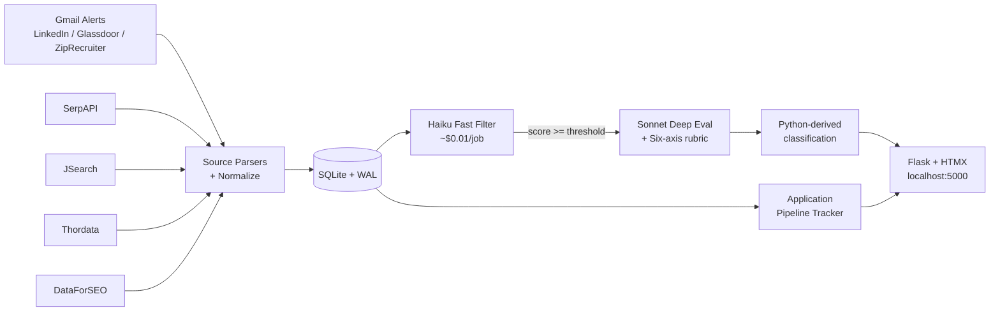

# Job Cannon


> A personal job-search command center: aggregates listings from Gmail
> alerts and SERP APIs, scores them with a two-tier Claude AI pipeline,
> and tracks application state. Single-user, runs on localhost.

[](https://github.com/Senkichi/job-cannon/actions/workflows/ci.yml)
[](https://www.python.org/downloads/)
[](https://github.com/astral-sh/ruff)
[](LICENSE)

## Engineering Highlights

- **Two-tier AI scoring with Python-derived classification.** Haiku 4.5
  fast-filters every job (~$0.01); Sonnet 4.6 deep-evaluates the top
  tier (~$0.10). Classification (`apply | consider | skip | reject`)
  is **derived in Python from a six-axis ordinal rubric — never
  emitted by the LLM** — which prevents classification drift across
  model upgrades.
- **Schema-versioned SQLite migrations.** 48 idempotent migrations
  applied via `pragma user_version`. Migration 41 introduces a
  backup-recency preflight that refuses destructive schema changes
  without a recent userdata snapshot (override via
  `GSD_BACKUP_CONFIRMED=1` for alternate backup schemes).
- **Background scheduler with cross-process safety.** APScheduler 3.x
  with a pidfile + psutil liveness check — survives Flask reloads,
  single-instance enforced. Auto-starts a local Ollama service for the
  nightly agentic-backfill tier.
- **HTMX-only frontend.** No JS framework, no bundler, no build step.
  Inline expansion, partial fragments, server-driven UI. 36 Jinja2
  templates, Tailwind via CDN, SortableJS for the kanban.
- **ATS coverage across 5 platforms with a tier-4 AI navigator.**
  Greenhouse, Lever, Ashby, SmartRecruiters, and Workday have explicit
  scanners; the AI navigator caches Playwright recipes (16 active) for
  the long-tail of custom-built career sites (iCIMS, Phenom, UKG,
  bespoke).
- **Eval harness with paired MAE + BCa bootstrap 95% CIs** for
  prompt-variant A/B testing across model providers (Anthropic +
  Ollama-local).
- **Cost-gated execution.** Configurable monthly budget cap; the
  cost-gate returns a bool and lets callers decide whether to
  fail-open or raise — the orchestrator and the scheduler choose
  differently and that's intentional.
- **2110 tests** (unit + integration + Playwright e2e) green on the CI
  matrix (Ubuntu + Windows × Python 3.13).

## Quick Start

```powershell
git clone https://github.com/Senkichi/job-cannon.git
cd job-cannon
uv sync --extra dev --extra eval

# First run only — DO NOT run if config.yaml or .env already exist:
if (-not (Test-Path config.yaml)) { Copy-Item config.example.yaml config.yaml }
if (-not (Test-Path .env))        { Copy-Item .env.example .env }
# Add ANTHROPIC_API_KEY to .env (https://console.anthropic.com/settings/keys)

uv run job-cannon
# Open http://localhost:5000
```

For Gmail OAuth setup and full configuration reference, see
[docs/SETUP.md](docs/SETUP.md).

## Architecture



For deeper subsystem detail, see [`docs/architecture/`](docs/architecture/).

## Tech Stack

| Layer | Tooling |
|---|---|
| Runtime | Python 3.13, Flask 3.1, APScheduler 3.x |
| Storage | SQLite (WAL mode) — raw SQL, no ORM |
| Frontend | Jinja2 + jinja2-fragments, HTMX 2.x, Tailwind (CDN), SortableJS |
| AI | Anthropic SDK (Claude Haiku + Sonnet); optional Ollama for local fallback |
| Sources | Gmail API v1 (OAuth), SerpAPI, JSearch, Thordata, DataForSEO |
| Tooling | uv (canonical), ruff, pre-commit, gitleaks, commitizen, pytest |
| CI | GitHub Actions (Ubuntu + Windows matrix), Codecov upload |

## Project Structure

```
job_finder/
|-- web/                    # Flask app (11 blueprints, scheduler, AI clients, ATS)
|-- parsers/                # Email parsers (LinkedIn, Glassdoor, ZipRecruiter, Indeed stub)
|-- sources/                # Data sources (Gmail, SerpAPI, JSearch, Thordata, DataForSEO)
|-- scoring/                # Two-tier scoring + six-axis rubric helpers
|-- eval/                   # Eval harness + bootstrap CIs
|-- models.py               # Job dataclass with dedup_key
|-- config.py               # YAML config loader + path discovery
|-- __main__.py             # `uv run job-cannon` entry point
`-- db.py                   # SQLite persistence (raw SQL, no ORM)
tests/                      # 2110 tests, unit + integration + e2e
docs/
|-- SETUP.md                # Gmail OAuth, config reference, troubleshooting
`-- architecture/           # Subsystem deep-dives
```

The 11 blueprints: `admin`, `batch_scoring`, `companies`, `costs`,
`dashboard`, `detections`, `jobs`, `pipeline`, `profile`, `settings`,
`sync`.

## Cost Estimates

Job Cannon uses Claude AI for scoring. The costs are low but worth
calling out:

| What | Cost | When |
|------|------|------|
| Haiku fast filter | ~$0.01–0.02 per job | Every new job found |
| Sonnet deep evaluation | ~$0.05–0.15 per job | Jobs above the Haiku threshold (42 by default) |

**Typical monthly cost:** $1–5 for 50–200 new jobs. A configurable
budget cap (default $25/mo, set in `config.yaml` under
`scoring.monthly_budget_usd`) prevents runaway. The app stops AI
scoring when the cap is reached and resumes the next month.

**Optional SERP sources:** SerpAPI, JSearch, Thordata, and DataForSEO
are all opt-in. Each has its own pricing tier — see
`config.example.yaml` for details.

## Platform Compatibility

- Developed on Windows 11, tested with Python 3.13.
- macOS / Linux supported (no Windows-only code paths). The repo's
  `.githooks/` are bash; on Windows use Git Bash.
- SQLite ships with Python — no separate database install.
- No Docker, no cloud services, no deployment required.

## Running Tests

```powershell
uv run --active pytest -q --tb=short        # full suite
uv run --active pytest -m "not e2e"         # skip Playwright e2e tier
uv run --active pytest tests/test_db.py -v  # one file
```

Tests use temp SQLite databases and a mocked Anthropic client — no API
keys needed for unit / integration. The e2e tier requires
`uv run --active playwright install chromium` once.

## Documentation

- **[Setup guide](docs/SETUP.md)** — Gmail OAuth, config, troubleshooting
- **[Architecture deep-dive](docs/architecture/)** — entry points,
  scoring, migration strategy, scheduler, concerns
- **[Contributing](CONTRIBUTING.md)** — development workflow, commit
  style, scope check
- **[Security policy](SECURITY.md)** — threat model, reporting

## License

[GNU AGPL v3.0 or later](LICENSE) — see LICENSE.
