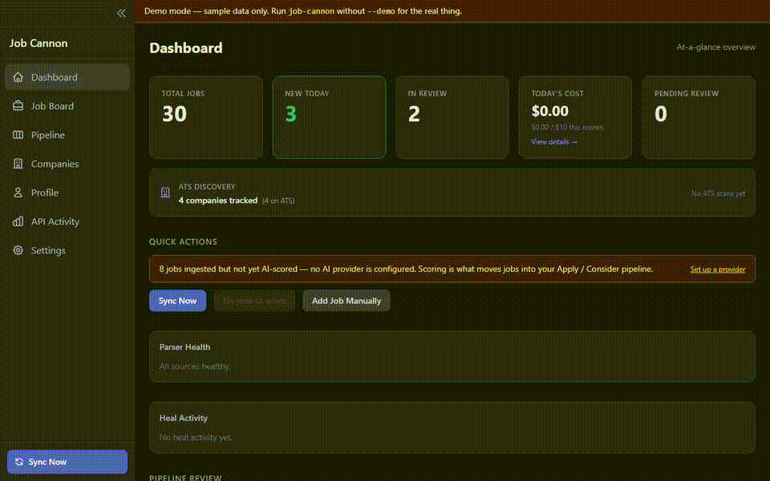
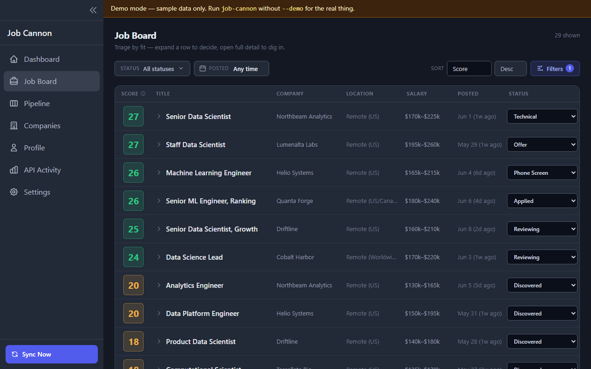
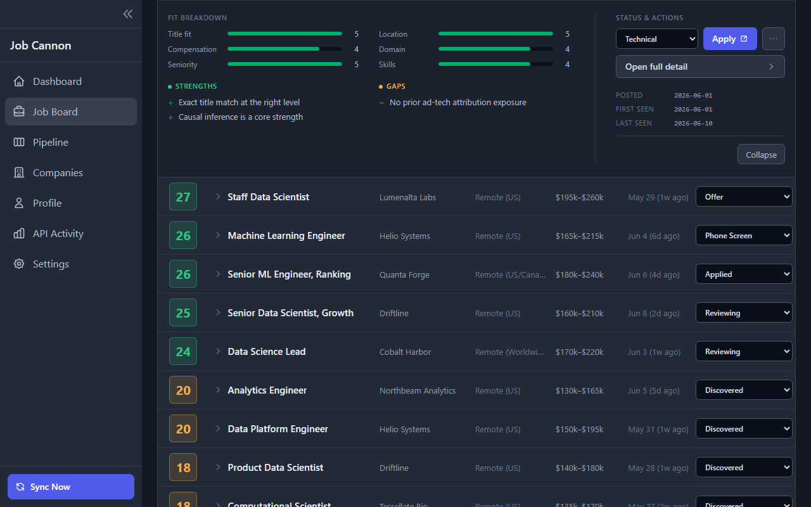
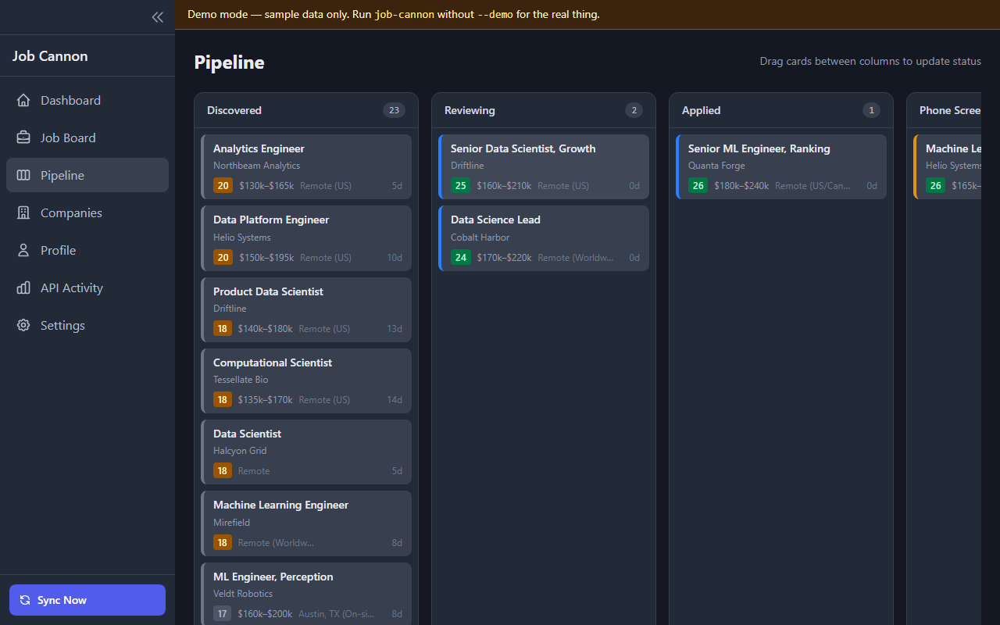
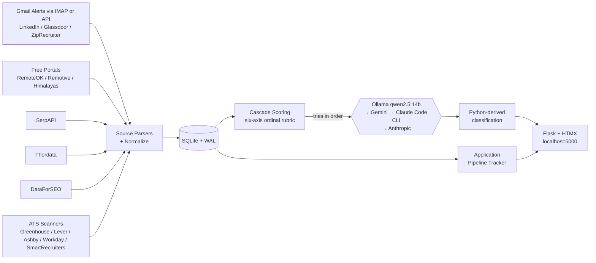

# Job Cannon


[](https://github.com/Senkichi/job-cannon/actions/workflows/ci.yml)
[](https://www.python.org/downloads/)
[](https://github.com/astral-sh/ruff)
[](LICENSE)

**Every job listing you care about — your Gmail alerts, free job boards, and the career pages of companies you watch — lands on one board, where AI scores each listing against *your* profile and tells you whether it's worth your time.** Track every application from Applied to Offer on a kanban pipeline. All of it runs on your own machine, for $0/month, and your resume never leaves your laptop.



- **Local-only.** No account, no cloud, no telemetry — your data is a SQLite file on your own disk. See [PRIVACY.md](PRIVACY.md).
- **$0 AI by default.** Scoring cascades through free providers (local Ollama → free cloud tiers → your existing Claude.ai subscription). A paid API key is an optional last resort, and even that is budget-capped.
- **It does not auto-apply to jobs.** Job Cannon is a command center, not a spam cannon. You decide what's worth applying to — it makes sure you see everything and forget nothing.

## Install

**Windows, no Python needed:** download `JobCannon-Setup-<version>.exe` from the [latest release](https://github.com/Senkichi/job-cannon/releases/latest) and run it — per-user install, no admin prompt, Start Menu shortcut, done. (Unsigned for now, so SmartScreen warns: **More info → Run anyway**. Details + checksums in [INSTALL.md](INSTALL.md).)

Everyone else (or if you prefer a managed Python install):

```bash
pipx install job-cannon
job-cannon
```

`pipx install job-cannon` is the recommended path: one command, isolated venv. Requires **Python 3.12+** — use `pipx install --python python3.12 job-cannon` if your default Python is older. The `job-cannon` command launches the Flask app on http://localhost:5000 and opens your browser. On first launch the onboarding wizard auto-detects AI providers (Ollama / Claude Code CLI / Gemini CLI), helps you connect Gmail via IMAP app password, and writes secrets to your OS keyring — no manual YAML editing required.

**Want to see it before configuring anything?** `job-cannon --demo` launches with ~30 sample scored jobs in a throwaway database — no config, no API keys, no background jobs, and your real data is untouched. It even runs alongside a live instance (picks the next free port).

**Don't have pipx yet?** Per-OS one-liners: `scoop install pipx` (Windows), `brew install pipx` (macOS), `apt install pipx` (Ubuntu 23.04+).

**Don't have Python either? One-liner that installs the Python bits for you:**

Windows PowerShell:

```powershell
irm https://raw.githubusercontent.com/Senkichi/job-cannon/main/bootstrap.ps1 | iex
```

macOS / Linux:

```bash
bash -c "$(curl -fsSL https://raw.githubusercontent.com/Senkichi/job-cannon/main/bootstrap.sh)"
```

The script checks for Python 3.12+, installs pipx into your user account if needed (never sudo/admin), then runs `pipx install job-cannon` and launches the app. Read it first if you like — it's short: [bootstrap.ps1](bootstrap.ps1) / [bootstrap.sh](bootstrap.sh).

**Already cloning the repo to hack on it?** See [For Contributors](#for-contributors) at the bottom.

**Other install paths and troubleshooting:** [INSTALL.md](INSTALL.md).

## Screenshots

**The job board** — every source in one place, AI-scored, classified, triaged inline:



**Inline fit analysis** — expand a row for the six-axis breakdown: strengths, gaps, and what to lead with:



**The pipeline** — drag applications from Applied through Offer:



(Captured from `job-cannon --demo` — all companies fictional.)

## FAQ

**Why no Docker?**
Deliberate. This is a single-user app that runs on `localhost` and stores everything in one SQLite file — a container adds an isolation layer with nothing to isolate, and makes the tray icon, browser auto-open, and OS keyring *harder*. `pipx install job-cannon` gives you the same one-command setup. (If a community Dockerfile appears, we'll link it as community-supported.)

**Is my data sent anywhere?**
The only outbound calls are to the job sources you enable (your inbox over IMAP, the free job portals, any paid SERP APIs you opt into) and the AI provider you pick. With local Ollama as the provider, job descriptions never leave your machine. There is no telemetry, no account, no analytics. Details: [PRIVACY.md](PRIVACY.md).

**Does it apply to jobs for me?**
No — deliberately. Auto-apply tools are why recruiters drown in spam and why those tools get accounts flagged. Job Cannon optimizes the part that's actually hard: seeing everything, knowing what's worth your time, and never losing track of an application. See [AUP.md](AUP.md).

**Why AGPL?**
It keeps forks open: anyone who runs a modified version as a service must share their changes. For personal use on your own machine it changes nothing.

**Can I use a non-Gmail inbox?**
The IMAP host and port are configurable (`sources.imap.host` / `sources.imap.port`), so any IMAP provider can work in principle — but honestly: only Gmail (with an app password) is tested today. The free portals and ATS scanners work with no email at all.

**Can I export my data?**
Your data *is* a regular SQLite file — `jobs.db` in the user-data directory (`%LOCALAPPDATA%\JobCannon\` on Windows, `~/Library/Application Support/JobCannon/` on macOS, `~/.local/share/JobCannon/` on Linux). Copy it, query it with any SQLite tool, or point a notebook at it. Nothing is locked in.

## Engineering Highlights

- **Single-tier ordinal scoring through a multi-provider cascade.**
  Every job runs through one `'scoring'` tier with a six-axis ordinal
  rubric. The cascade tries free providers first
  (Ollama local → Gemini → Claude Code CLI) and falls through to
  the paid Anthropic SDK only when all free options are exhausted or
  rate-limited. Phase 33 shootout selected `qwen2.5:14b` (Ollama) as
  the production primary; typical monthly cost is ~$0. Classification
  (`apply | consider | skip | reject | low_signal`) is **derived in
  Python from the numeric sub-scores — never emitted by the LLM** —
  which prevents classification drift across model swaps.
- **Schema-versioned SQLite migrations.** 90+ idempotent migrations
  (one module per schema version) applied via `pragma user_version`.
  Migration 41 introduces a
  backup-recency preflight that refuses destructive schema changes
  without a recent userdata snapshot (override via
  `GSD_BACKUP_CONFIRMED=1` for alternate backup schemes).
- **Background scheduler with cross-process safety.** APScheduler 3.x
  with a pidfile + psutil liveness check — survives Flask reloads,
  single-instance enforced. Auto-starts a local Ollama service for the
  nightly agentic-backfill tier.
- **HTMX-only frontend.** No JS framework, no bundler, no build step.
  Inline expansion, partial fragments, server-driven UI. ~60 Jinja2
  templates, Tailwind via CDN, SortableJS for the kanban.
- **ATS coverage across 5 platforms with a tier-4 AI navigator.**
  Greenhouse, Lever, Ashby, SmartRecruiters, and Workday have explicit
  scanners; the AI navigator caches Playwright recipes for
  the long-tail of custom-built career sites (iCIMS, Phenom, UKG,
  bespoke).
- **Self-healing parsers (default on).** Each source's extraction is
  monitored for break signals (a previously-yielding parser going to
  zero). When a source degrades, the heal pipeline assembles a corpus of
  failing + prior-working samples, has an LLM generate a *declarative*
  extraction recipe (CSS selectors / field aliases — never generated
  code), and adopts it only after a subprocess corpus-replay proves it
  fixes the break without regressing any prior-working sample. A
  shipped-default recipe shadow-compared against the live extractor is
  auto-retired if it underperforms, so no recipe is ever unremovable.
  Without a configured LLM provider it costs nothing — the source just
  surfaces as DEGRADED on the dashboard. Disable with
  `autoheal.heal_enabled: false`.
- **Eval harness with paired MAE + BCa bootstrap 95% CIs** for
  prompt-variant A/B testing across the full provider matrix
  (Ollama-local, Groq, Cerebras, Gemini, Anthropic).
- **Cost-gated execution.** Configurable daily budget cap
  (`scoring.daily_budget_usd`, default $10/day); the cost-gate returns
  a bool and lets callers decide whether to fail-open or raise — the
  orchestrator and the scheduler choose differently and that's
  intentional.
- **5,000+ tests** (unit + integration + Playwright e2e) green on the CI
  matrix (Ubuntu × Python 3.12/3.13 + Windows × Python 3.13).
- **In-app update notifications.** Dashboard surfaces an "Update available"
  banner when a newer GitHub release is detected; check is throttled to
  once-per-day, dismissible per-version, never blocks app startup if the
  network is down.

## Architecture



For deeper subsystem detail, see [`docs/architecture/`](docs/architecture/).

## Tech Stack

| Layer | Tooling |
|---|---|
| Runtime | Python 3.12+, Flask 3.1, APScheduler 3.x |
| Storage | SQLite (WAL mode) — raw SQL, no ORM |
| Frontend | Jinja2 + jinja2-fragments, HTMX 2.x, Tailwind (CDN), SortableJS |
| AI | Multi-provider cascade: Ollama (qwen2.5:14b primary) → Gemini → Claude Code CLI ($0 via Claude.ai subscription, dispatched through `claude -p`) → Anthropic SDK (paid, final fallback) |
| Sources | Gmail via IMAP app-password (default) or Gmail API OAuth; free portals (RemoteOK / Remotive / Himalayas); SerpAPI / Thordata / DataForSEO (optional, paid) |
| Tooling | uv (canonical), ruff, pre-commit, gitleaks, commitizen, pytest |
| CI | GitHub Actions (Ubuntu + Windows matrix) |

## Project Structure

```
job_finder/
|-- web/                    # Flask app (14 blueprints, scheduler, AI clients, ATS)
|-- parsers/                # Email parsers (LinkedIn, Glassdoor, ZipRecruiter, Indeed stub)
|-- sources/                # Data sources (Gmail, SerpAPI, Thordata, DataForSEO)
|-- scoring/                # Single-tier ordinal scoring + six-axis rubric helpers
|-- eval/                   # Eval harness + bootstrap CIs
|-- models.py               # Job dataclass with dedup_key
|-- config.py               # YAML config loader + path discovery
|-- __main__.py             # `uv run job-cannon` entry point
`-- db/                     # SQLite persistence (raw SQL, no ORM); package since S7d (2026-05-06)
tests/                      # 5,000+ tests, unit + integration + e2e
docs/
|-- SETUP.md                # Gmail OAuth, config reference, troubleshooting
`-- architecture/           # Subsystem deep-dives
```

The 14 blueprints: `admin`, `batch_scoring`, `companies`, `costs`,
`dashboard`, `detections`, `events`, `jobs`, `onboarding`, `pipeline`,
`profile`, `settings`, `sync`, `updates`.

## Cost Estimates

Every provider in the default cascade is **$0** out-of-pocket. Ollama
runs locally; Gemini sits on its free tier; and the Claude Code CLI
fallback dispatches through `claude -p` against your Claude.ai
subscription, so usage there is metered against your existing plan
rather than billed per call.

| Provider | Cost | When |
|------|------|------|
| Ollama (qwen2.5:14b local) | $0 | Primary — runs locally |
| Gemini free tier | $0 | Falls through if Ollama unavailable or returns invalid output |
| Claude Code CLI (`claude -p`) | $0 (via Claude.ai subscription) | Next in chain; uses your plan's allowance |
| Anthropic SDK | Paid (per call) | Final emergency fallback only — not reached in normal use |

A configurable daily budget cap (default $10/day, set in `config.yaml`
under `scoring.daily_budget_usd`) trips only on non-free BYO-key
providers in the cascade — in practice, the OpenRouter judge used by
the cascade-audit harness. All members of `claude_client.FREE_PROVIDERS`
(including the Claude Code CLI fallback) are excluded from the gate.

**Optional SERP sources:** SerpAPI, Thordata, and DataForSEO
are all opt-in. Each has its own pricing tier — see
`config.example.yaml` for details.

## Platform Compatibility

- Developed on Windows 11, tested with Python 3.12 and 3.13.
- macOS / Linux supported (no Windows-only code paths). The repo's
  `.githooks/` are bash; on Windows use Git Bash.
- SQLite ships with Python — no separate database install.
- No Docker, no cloud services, no deployment required.

## Running Tests

```powershell
uv run --active pytest -q --tb=short        # full suite
uv run --active pytest -m "not e2e"         # skip Playwright e2e tier
uv run --active pytest tests/test_db.py -v  # one file
```

Tests use temp SQLite databases and a mocked Anthropic client — no API
keys needed for unit / integration. The e2e tier requires
`uv run --active playwright install chromium` once.

## Documentation

- **[Setup guide](docs/SETUP.md)** — Gmail OAuth, config, troubleshooting
- **[Architecture deep-dive](docs/architecture/)** — entry points,
  scoring, migration strategy, scheduler, concerns
- **[Contributing](CONTRIBUTING.md)** — development workflow, commit
  style, scope check
- **[Security policy](SECURITY.md)** — threat model, reporting

## Legal

- **[License (AGPL-3.0)](LICENSE)** — license text
- **[Privacy policy](PRIVACY.md)** — what data the app touches, where it lives, what it sends out
- **[Acceptable use](AUP.md)** — prohibited uses and operator responsibilities
- **[Security policy](SECURITY.md)** — reporting channel, scope, disclosure

## For Contributors

Working on Job Cannon itself? Use the clone-and-sync flow — you get the test suite, the eval harness, and a writable `.venv/` you can iterate against. (End users should use `pipx install job-cannon` from the [Install](#install) section above.)

**Prerequisites:** Python 3.12+, [uv](https://docs.astral.sh/uv/getting-started/installation/). For free local AI scoring install [Ollama](https://ollama.com) and run `ollama pull qwen2.5:14b`.

**macOS / Linux / Git Bash**

```bash
git clone https://github.com/Senkichi/job-cannon.git
cd job-cannon
uv sync --extra dev --extra eval
uv run job-cannon
```

**Windows PowerShell**

```powershell
git clone https://github.com/Senkichi/job-cannon.git
cd job-cannon
uv sync --extra dev --extra eval
uv run job-cannon
```

Open http://localhost:5000 (the app auto-opens it for you). On first launch the **onboarding wizard** auto-detects AI providers, enables free job portals (RemoteOK / Remotive / Himalayas — no credentials, jobs arrive on the first sync), helps you connect Gmail via IMAP app-password, and writes secrets to your OS keyring — no manual config editing required.

**Works with zero API keys.** Free portals (RemoteOK, Remotive, Himalayas) are enabled by default so the first ingest returns real results even before you set up Gmail alerts. Add Ollama for $0 local AI scoring, or the wizard auto-detects Gemini CLI and Claude Code CLI as free-cloud fallbacks. Prefer to edit YAML directly? Copy the templates instead and skip the wizard:

```bash
cp config.example.yaml config.yaml
cp experience_profile.example.json experience_profile.json
```

**Keep config + database inside the repo (optional — easier backup):**

```bash
export JOB_CANNON_USER_DATA_DIR=$(pwd)              # macOS / Linux / Git Bash
```

```powershell
$env:JOB_CANNON_USER_DATA_DIR = (Get-Location).Path  # Windows PowerShell
```

Otherwise data lives at `%LOCALAPPDATA%\JobCannon\` (Windows) / `~/Library/Application Support/JobCannon/` (macOS) / `~/.local/share/JobCannon/` (Linux).

**`config.yaml` keys to fill in (if you skipped the wizard):**

| Key | Required | Notes |
|-----|----------|-------|
| `profile.target_titles` | **yes** | Job titles to target, e.g. `["Senior Data Scientist"]` |
| `profile.target_locations` | **yes** | Locations or `["Remote"]` |
| `profile.skills` | **yes** | Your key skills |
| `sources.imap.email` + `app_password` | optional | Gmail via IMAP — use an [app password](https://support.google.com/accounts/answer/185833), not your account password. No OAuth required. |
| `sources.serpapi.api_key` | optional | Paid SERP API for Google Jobs search |
| `providers.primary` | optional | Default `ollama` ($0 local); swap to `gemini` or `anthropic` if Ollama is not installed |

For full configuration reference — provider table, source setup, troubleshooting — see [docs/SETUP.md](docs/SETUP.md).

## License

[GNU AGPL v3.0](LICENSE) — see LICENSE.
